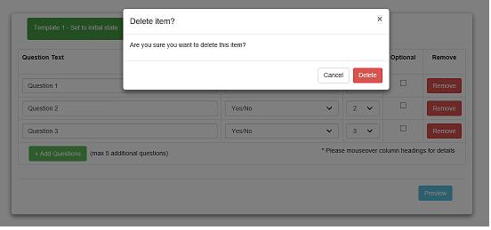
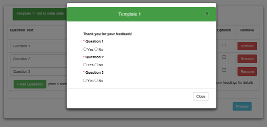
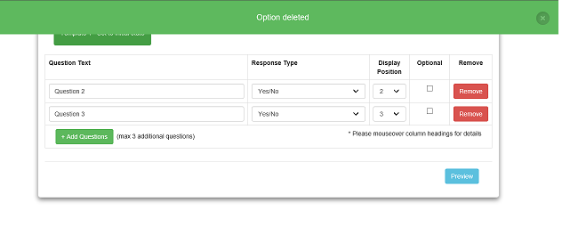

# angular-modal-notify
This project shows how to implement modal windows and alert messages using AngularJS and Bootstrap.

All the dependencies have been included so you don't need to install anything else, it's ready for testing and using as you wish.

  
  
    

